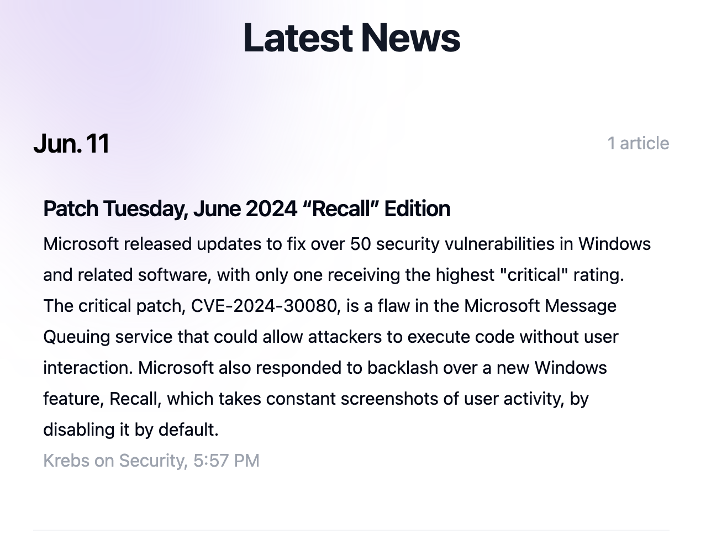

# harperdb-news-summarization
HarperDB Application, Service, and User Interface for automatically ingesting RSS new feeds, summarizing them, and saving them into HarperDB for viewing.



## Requirements
* HarperDB 4.3+
* Node v18+

## Instructions

```shell
# Clone the repository
git clone https://github.com/makvoid/harperdb-news-summarization.git
cd harperdb-news-summarization

# Install yarn if needed (or use a different package manager, npm, pnpm, etc)
# npm install -g yarn

# Install dependencies
cd application && yarn
cd ../user-interface && yarn

# Build the User Interface
yarn build

# Copy to the application folder
rm -rf ../application/web
cp -r build ../application/web

# Add a password for the HDB_ADMIN user in docker-compose.yml
cd ..
nano docker-compose.yml
# Add the password to line 9

# Start the docker container
docker compose up -d
```

Next, login to [HarperDB Studio](https://studio.harperdb.io/) and register the container you just launched as an 'Enterprise' Instance.

Once added, we need to add a role and User for the article ingestion. You don't want to make a habit of using the regular Admin credentials, however, you can skip this step and use them instead if you would like.

### Adding the Role
* Login to HarperDB Studio, select the launched instance
* Click 'roles' at the top and click the '+' icon under 'standard roles'.
* Create a new role, and then select it afterwards.
* Ensure the role has access to read, insert and update for the `Entry` table.
* Save the role.

### Add a User
* Login to HarperDB Studio, select the launched instance.
* Click 'users' at the top and add a User on the left-hand side and select the role created last step.

## Continued Installation

Once you have the User and role added, we have to update the systemd service file with this information. We'll add the credentials you just created, and also don't forget to fill out the correct endpoint as well.

```shell

# Edit service environment variables
# 1. Update `WorkingDirectory` to your HDB data dir
# 2. Update `User` to your local non-root User you have HDB running under
# 3. Update `HDB_ENDPOINT` to the IP Address, port and table name (ex. `https://10.16.1.35:9926/Entry`)
# 4. Update `HDB_USERNAME` and `HDB_PASSWORD` to the ingestion User created above.
# 5. Update `ExecStart` to have the full node path (if unsure, run `which node`) and the correct path to the script
nano systemd/news-fetcher.service

# Copy the files into place
sudo cp systemd/* /usr/lib/systemd/system/
sudo systemctl daemon-reload

# Start the service and monitor for any errors
sudo systemctl start news-fetcher.service && \
 sudo journalctl -u news-fetcher.service -f -l --lines 100

# If all is good, go ahead and enable the timer for automatic execution
sudo systemctl enable news-fetcher.timer && \
  sudo systemctl start news-fetcher.timer
```

In your web browser, you should now be able to open the Applications port and see the user interface. When it asks you for a login, you can provide your admin credentials or the ingestion credentials.

For example, if you are using HarperDB locally via Docker, we could access it via this endpoint: `https://localhost:9926/news`.

## Resources

* YouTube video guide for this article
* [HarperDB](https://docs.harperdb.io)
* [HarperDB Applications](https://docs.harperdb.io/docs/developers/applications)
* [Groq](https://groq.com/)
